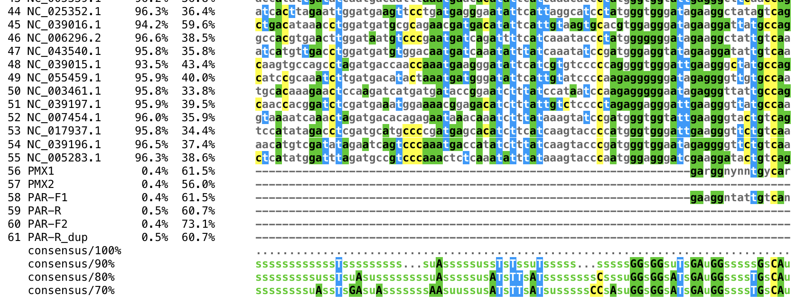

# assessPrimers
A tool to aid PCR primer design and evaluation. Developed in association with the [In Situ Lab](https://insitulabs.org/) initiative.

The primer assessment tool requires several inputs including:
1) List of nucleotide reference sequences
2) List of forward and reverse primers, respectively (degenerate bases are allowed)
3) A reference protein sequence (optional)
4) Prefix for output files

The inputs are used to create a non-redundant multiple sequence alignment of all references sequences to each other as well as to each primer pair. From this alignment, the following statistics are printed to stdout:

Primer number: The number of unique primers calculated after converting all degenerate bases to their non-degenerate equivalents.

Entropy: Cumulative entropy score for each length of k-mer along the alignment (lower entropy scores reflect more conserved sequences)

Start coordinate position

Number mismatches: For each primer provided, histogram of the number of mismatches for each reference sequence

### Additional outputs

Sequence statistics text file (tab-delimited): Provides the number of mismatches detected for each sequence primer combination

K-mer statistics text file (tab-delimited): For each k-mer along the alignment: coordinate start position, cumulative entropy score, number of gaps, number of non-degenerate primers to match all reference sequences, degenerate consensus sequence, primer name (default name is ‘blank’, unless the k-mer matches one of the input primers)

Multiple sequence alignment files


### Notes
1) Temporary and in-between outputs are saved to the same location as the final outputs. 
2) Any number of forward and reverse primers can be analyzed, and the current version of this software requires that they be paired.

## Stepwise Analysis pipeline:
1) Reverse-complement reverse primers
2) Filter reference sequences with N content > filtN parameter (default = 0.05)
3) Make blast database from reference sequence file
4) If reference protein sequence has been provided remove references that do not match
5) Collapse reference sequences with identity > idcutoff parameter (default = 0.9).
6) Create multiple sequence alignment file
7) Generate primer and sequence statistics

## Example outputs
### stdout
```
PMX1 coordinate: 3106 entropy: 0.27 numPrimers:32768 GARGGNYNNTGYCARAARNTNTGGAC
PMX1 captures:
45 sequences with 0 mismatches
6 sequences with 1 mismatch(es)
4 sequences with 2 mismatch(es)

PMX2 coordinate: 3202 entropy: 0.33 numPrimers:65536 GGNGAYAAYCARNYNATWGCNRTNA
PMX2 captures:
31 sequences with 0 mismatches
19 sequences with 1 mismatch(es)
3 sequences with 2 mismatch(es)
2 sequences with 3 mismatch(es)
```
### kmer_statistics_primers.txt
```
#coordinate	entropy	numGaps	numPrimers	consensusSequence	primerName
1	0.23	1058	768	NKRARGAGAGTCAMTRDWAC
2	0.19	1067	192	KRARGAGAGTCAMTRDWACA
3	0.19	1066	192	RARGAGAGTCAMTRDWACAK
4	0.19	1059	288	ARGAGAGTCAMTRDWACAKV
5	0.21	1051	576	RGAGAGTCAMTRDWACAKVY
6	0.21	1045	864	GAGAGTCAMTRDWACAKVYD
7	0.26	1039	3456	AGAGTCAMTRDWACAKVYDN
8	0.29	1031	10368	GAGTCAMTRDWACAKVYDNB
9	0.32	1023	31104	AGTCAMTRDWACAKVYDNBD
```
### sequence_statistics.txt
```
#sequence	primer	numMismatches
NC_025352.1	PMX1	1
NC_039019.1	PMX1	1
NC_030231.1	PMX1	1
NC_001906.3	PMX1	2
NC_002728.1	PMX1	2
NC_005084.2	PMX1	2
NC_005339.1	PMX1	2
NC_039015.1	PMX1	1
NC_025363.1	PMX1	1
NC_025386.1	PMX1	1
```
### mafft_primers.fa

